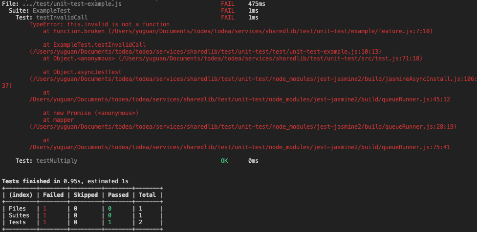

# Unit Testing Utils <!-- omit in toc -->
Todea unit test utils provides a thin wrapper around Jest and Supertest to help
improve organization of test cases, and display only relavant debug information
to speed up development.

## Topics <!-- omit in toc -->
- [Writing tests](#writing-tests)
  - [Organization](#organization)
  - [Example](#example)
- [Custom Reporters](#custom-reporters)

# Writing tests
## Organization
Unit tests are organized by test file, suite, and case.

- Files: each corresponds to a source file. For example, unit tests for
  src/example.js could be authored in a file named unit-test-example.js. Note: this is controlled by a Jest setting.
- Suites: a unit test file can contain 1 or more test suites. A test suite is a
  class containing a group of test cases focused on a single feature /
  functionality. A test suite is a subclass of `BaseTest`.
- Tests: a function with `test` or `testOnly` as the prefix.

## Example
For example, you have some source file in feature.js:
```javascript <!-- embed:./example/feature.js:scope:Example -->
class Example {
  static multiply (a, b) {
    return a * b
  }

  static broken () {
    this.invalid()
  }

  // istanbul ignore next
  static ignored () {

  }
}
```

The test suite would be placed in a `unit-test-example.js` file, in a test suite `ExampleTest`, which have 2 test cases.
```js
const { BaseTest, runTests } = require('@pocketgems/unit-test')
```

```javascript <!-- embed:./test/unit-test-example.js:scope:ExampleTest -->
class ExampleTest extends BaseTest {
  testMultiply () {
    expect(Example.multiply(2, 3)).toBe(6)
  }

  testInvalidCall () {
    expect(() => Example.broken()).toThrow()
  }
}
```

The test suite is run by the `runTests` helper like this:
```js
runTests(ExampleTest)
```

# Custom Reporters
This library also provides custom Jest reporters, you can configure Jest to use these like this:
```json
"reporters": [
    "@pocketgems/unit-test/src/custom-reporter.js",
    "@pocketgems/unit-test/src/summary-reporter.js"
]
```

These reporters associates logs with each test case, and only displays logs for failed test cases while hiding passed tests automatically. It also includes how many milliseconds each test spent, and will warn if there is a particularly slow test.


